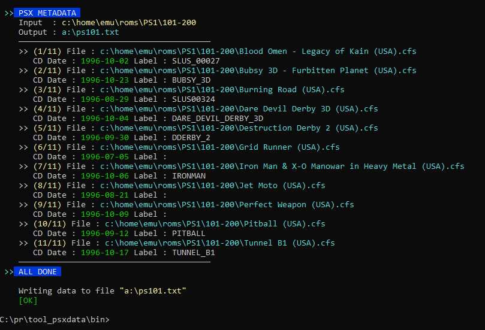

## PSX CD Metadata Extractor

This is a tool to extract metadata from PlayStation 1 CDs, reading from the Primary Volume Descriptor sector. *(More information here : https://problemkaputt.de/psx-spx.htm#cdromisovolumedescriptors)*


#### What metadata?

- Volume Creation Timestamp `e.g. "1996-11-11"`
- Publisher Identifier `e.g. "UEP_SYSTEMS"`
- CD Label `e.g. "COOLBOARDERS"`

> there are more fields of data but these are the most useful ones I think

#### The program

Basically **the purpose** of this program is to mass read PlayStation 1 CD Images and generate a TEXT file with all the parsed CD metadata in it.

- Is a Node.js script (*bundled in downloads*) for Windows Only
- Reads PlayStation 1`.bin` files
- Can work with `.zip` archives that contain `.bin` files. *Check the section below.*
- Operates on entire folders and can deep-scan them for files
- Generates output on the terminal AND on an output file that you specify


#### ZIP File Support

In case all your `.bin` files are inside separate `.zip` archives do not worry. This supports the external program **PISMO MOUNT** *(must be installed)*. Using this, it can automatically mount the `.zip` files and read the `.bin` file without the need of extracting the zip first.

Download and install "**Pismo File Mount Audit Package build 192**"  
from here : https://pismotec.com/download/

###### NOTES

- Will only read the first `.bin` it encounters in a `.zip` file
- This is because usually every `.zip` archive holds a single game
- In case of multiple CDs inside a `.zip` the important metadata should be the same, like the date and publisher. So the data is still correct.

#### Running Example

- scan all `.bin` files in `c:\roms\ps1`
- deep scan in every subfolder `-d`
- generate output file in `c:\temp\ps1_meta.txt`

```
node psxmeta -d c:\roms\ps1 -o c:\temp\ps1_meta.txt
```


#### Running Example , also scan ZIP files

- same as above, but just add the `-zip` argument
- this will scan `.bin` files , as well as `.zip` files
- this will try to run PISMO FILE MOUNT to mount the archives

```
node psxmeta -d -zip c:\roms\ps1 -o c:\temp\ps1_meta.txt
```


#### Output File Structure

It generates a simple `.txt` containing the data of all the CD images that were parsed.

The format of the data is:

`CD FILENAME | DATE | LABEL | PUBLISHER`

The reason I am choosing `|` to separate the fields, is that `|` cannot be part of any filename/label or publisher(?) so it is safe to get each line and to a `.split('|')` to return an array with all the fields of each line.

###### Example of a generated text file:

```

 >> PSX METADATA 
    Input  : c:\home\emu\roms\ps1
    Output : a:\psx_meta.txt
----------------------------------------
Carnage Heart (USA).zip|1996-11-17|SCUS_94604|
Cool Boarders (USA).zip|1996-11-11|COOLBOARDERS|UEP_SYSTEMS
Divide, The - Enemies Within (USA).zip|1996-11-05|SLUS00317|VIACOM NEW MEDIA
```

#### Program preview

